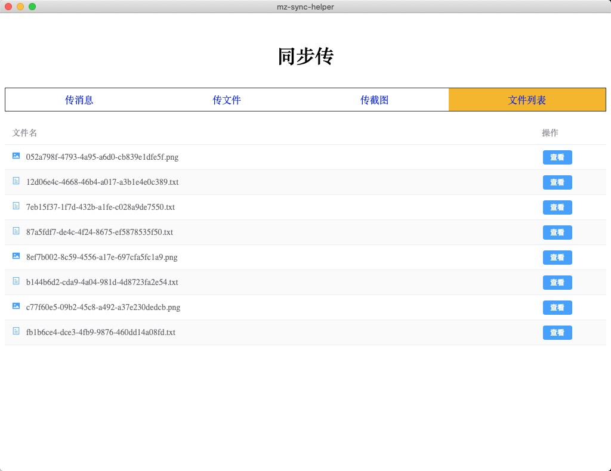
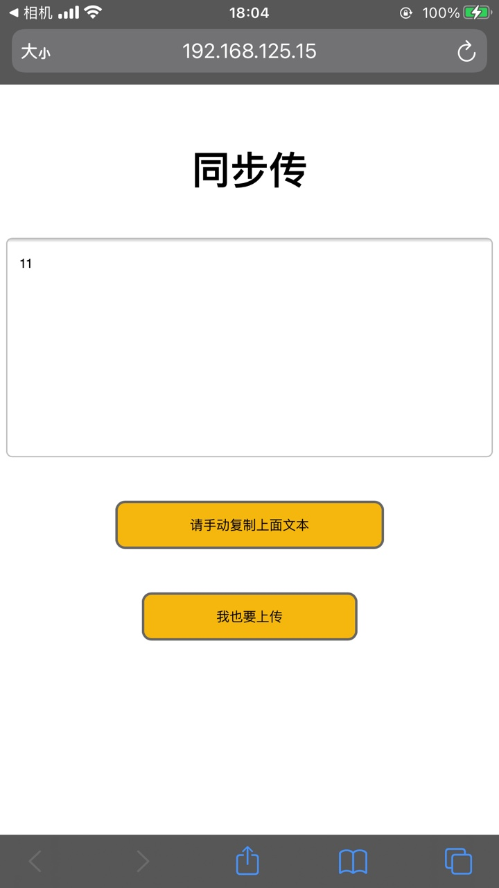

## MZ-Sync-Helper
文件同步助手，同一局域网内，在不同设备上通过链接同步读取文件
- 文件同步、共享
- api接口服务

## 设置环境变量
mac
```js
export ENV=development && wails dev
export ENV=production && wails build
```

## 技术栈
```js
go + vue3 + jsx + vite
```

## api接口
### address
接口描述：
* 获取本机ip

请求方式：
* GET http://localhost:27149/api/v1/address

请求参数：
* 无

请求示例：
```ts
http://localhost:27149/api/v1/address
```
### qrcode
接口描述：
* 生成二维码

请求方式：
* GET http://localhost:27149/api/v1/qrcode

请求参数：
* 无

请求示例：
```ts
http://localhost:27149/api/v1/qrcode?content=111
```
### uploads
接口描述：
* 获取上传文件列表

请求方式：
* GET http://localhost:27149/api/v1/uploads

请求参数：
* 无

请求示例：
```ts
http://localhost:27149/api/v1/uploads
```
### files
接口描述：
* 上传文件

请求方式：
* POST http://localhost:27149/api/v1/files

请求参数：
* form-data

请求示例：
无
### texts
接口描述：
* 上传text

请求方式：
* POST http://localhost:27149/api/v1/files

请求参数：
* form-data

请求示例：
无

## 效果


